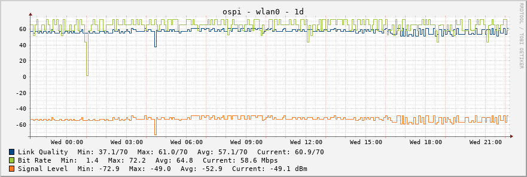

# rpi-utils > wifi

## monitor-wifi-quality.sh

Script to monitor Link Quality, Bit Rate, Signal Level and Noise Level as reported by iwconfig. Intended to be run from cron once every 5 minutes, the script stores information in a RRD file and graphs the data using rrdtool.

### Sample graph

